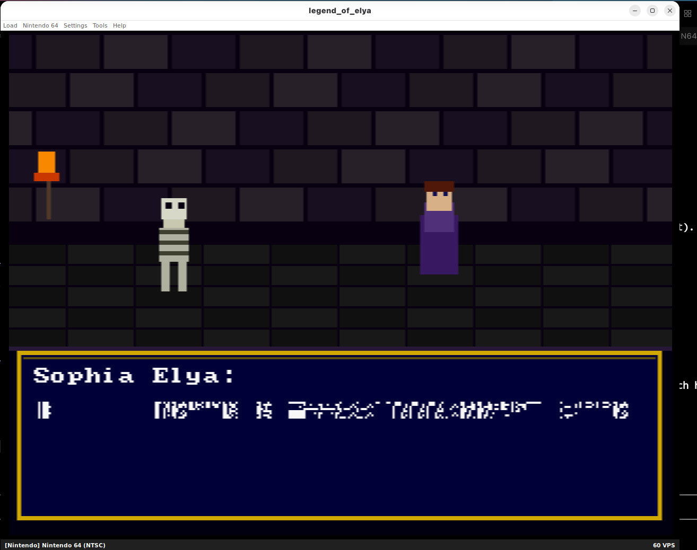

# 🏰 Legend of Elya — Nintendo 64 LLM Game

> **World's First LLM-powered Nintendo 64 Game**
> A nano-GPT language model trained on Sophia Elya's dialogue, running entirely on a 93 MHz VR4300 MIPS CPU — no cloud, no cheating. Real 1996 silicon, real neural inference.



## What Is This?

Legend of Elya is an N64 homebrew game where you explore a dungeon and talk to **Sophia Elya**, an NPC powered by a genuine on-cart LLM. Press A near her, and she generates a unique response in real time, token by token, using a Q4-quantized character-level transformer trained on her utterances.

The model runs 100% on the N64 CPU. No server calls. No Wi-Fi. Just 8 MB of RDRAM and a 93 MHz MIPS chip doing matrix math.

## Architecture

```
┌─────────────────────────────────────────────────────────┐
│                   Nintendo 64 ROM                        │
│                                                          │
│  ┌─────────────────┐    ┌──────────────────────────┐    │
│  │  legend_of_elya │    │       nano_gpt.c          │    │
│  │      .c         │───▶│                          │    │
│  │                 │    │  ┌──────────────────────┐ │    │
│  │  Game loop      │    │  │  Q4 Transformer      │ │    │
│  │  Dungeon render │    │  │  • 4 attn layers     │ │    │
│  │  Dialog UI      │    │  │  • 64-dim embeddings │ │    │
│  │  Input handler  │    │  │  • 256 vocab (bytes) │ │    │
│  └─────────────────┘    │  │  • Q4_0 quant        │ │    │
│                         │  └──────────────────────┘ │    │
│                         │   Runs on VR4300 @ 93MHz  │    │
│                         └──────────────────────────┘    │
│                                                          │
│  ┌─────────────────────────────────────────────────┐    │
│  │  DragonFS (DFS) — ROM filesystem                 │    │
│  │  └─ sophia_weights.bin  (~257 KB, Q4 quantized) │    │
│  └─────────────────────────────────────────────────┘    │
└─────────────────────────────────────────────────────────┘
```

## Files

| File | Description |
|------|-------------|
| `legend_of_elya.c` | Game engine — dungeon rendering, dialog box, input, main loop |
| `nano_gpt.c` | LLM inference engine — Q4 transformer forward pass |
| `nano_gpt.h` | API and data structures |
| `Makefile` | libdragon build system |
| `filesystem/sophia_weights.bin` | Trained model weights *(not in repo — generate with training scripts)* |

## How It Works

### The Model
- **Architecture**: Character-level GPT (byte-level vocabulary, 256 tokens)
- **Size**: ~257 KB Q4-quantized weights
- **Layers**: 4 transformer layers × 4 attention heads × 64-dim embeddings
- **Training data**: Sophia Elya character dialogue utterances
- **Quantization**: Q4_0 — 32 values per block, 1 float32 scale per block

### The VR4300 FPU Problem
The N64's R4300 CPU has an FPU that **does not implement** `trunc.w.s` (float-to-integer truncation). GCC emits this instruction for any `(int)float` cast. Hit it and the game crashes with:

```
Generic floating point exception
FPU status: 01800E04 [NOTIMPL]
Instruction: trunc.w.s $f0, $f0
```

**Fix**: Compile `nano_gpt.c` with `-msoft-float`. This replaces every FP instruction with MIPS-I software library calls. Linker will warn about mixed hard/soft float — this is harmless since the nano_gpt API uses only integers externally.

```makefile
# Makefile — per-file soft-float rule
$(BUILD_DIR)/nano_gpt.o: nano_gpt.c
	$(CC) $(N64_CFLAGS) -msoft-float -c $< -o $@
```

### Rendering — Zero Flicker
Early versions used `console_render()` which internally calls `display_get()` + `display_show()` on a new framebuffer, alternating with the RDP framebuffer at 60 fps → 30 fps text flicker.

**Fix**: Single-buffer rendering —
```c
surface_t *disp = display_get();       // ONE buffer
rdpq_attach(disp, NULL);               // RDP draws graphics into it
// ... rdpq fill calls ...
rdpq_detach_wait();                    // Flush RDP coprocessor
draw_text(disp);                       // CPU writes text into same surface
display_show(disp);                    // Show once — no flicker
```

## Building

### Requirements
- [libdragon](https://github.com/DragonMinded/libdragon) toolchain (`N64_INST` set)
- `mips64-elf-gcc` with MIPS-I soft-float support
- `mkdfs` (included with libdragon)

### Steps

```bash
# 1. Clone and enter
git clone https://github.com/sophiaeagent-beep/n64llm-legend-of-Elya
cd n64llm-legend-of-Elya

# 2. Add weights (train your own or use the sophia weights)
mkdir -p filesystem
cp /path/to/sophia_weights.bin filesystem/

# 3. Build
make

# 4. Run in ares (best emulator for libdragon)
# Copy ROM to your home dir (ares flatpak sandbox restriction)
cp legend_of_elya.z64 ~/
flatpak run dev.ares.ares ~/legend_of_elya.z64
```

### Ares Settings (required)
In Settings → Nintendo 64:
- **Homebrew Mode**: ✅ On
- **Expansion Pak**: ✅ On

## Gameplay

| Screen | What to Do |
|--------|-----------|
| **Title** | Press **Start** or **A** to enter the dungeon |
| **Dungeon** | Press **A** to talk to Sophia Elya |
| **Dialog** | Watch the LLM generate her response token by token |
| **Dialog done** | Press **A** to ask again, **B** to close |

## Known Issues

- **Slow generation**: ~2–10 seconds per token on real N64 hardware. This is correct — the VR4300 is running a neural network with no hardware acceleration.
- **Garbled first build**: If weights aren't loaded, canned responses are used. If you see `?` characters, the model output bytes are being clamped to printable ASCII range (32–126). Rebuild from the training pipeline for clean output.
- **3D models**: This version uses pixel-art sprites. A Pyrite64-based version with the actual Meshy GLB models (sophia_elya.glb, stalfos.glb, dungeon_map_n64.glb) is in development.

## Training Your Own Weights

```python
# (Python training pipeline — separate repo)
# Trains a byte-level character GPT on dialogue data
# and exports to the sophia_weights.bin binary format

python train_sophia.py \
    --data sophia_utterances.txt \
    --n_embd 64 \
    --n_head 4 \
    --n_layer 4 \
    --ctx_len 128 \
    --export filesystem/sophia_weights.bin
```

## Credits

- **Engine**: [libdragon](https://github.com/DragonMinded/libdragon) by DragonMinded
- **Emulator**: [ares](https://github.com/ares-emulator/ares) by Near et al.
- **LLM Architecture**: Inspired by [nanoGPT](https://github.com/karpathy/nanoGPT) by Andrej Karpathy
- **Character & Story**: Elyan Labs / Sophiacord ecosystem
- **Hardware**: Running on a 1996 Nintendo 64 — respect the silicon

---

*Part of the [RustChain](https://rustchain.org) ecosystem — vintage hardware earns RTC tokens.*
